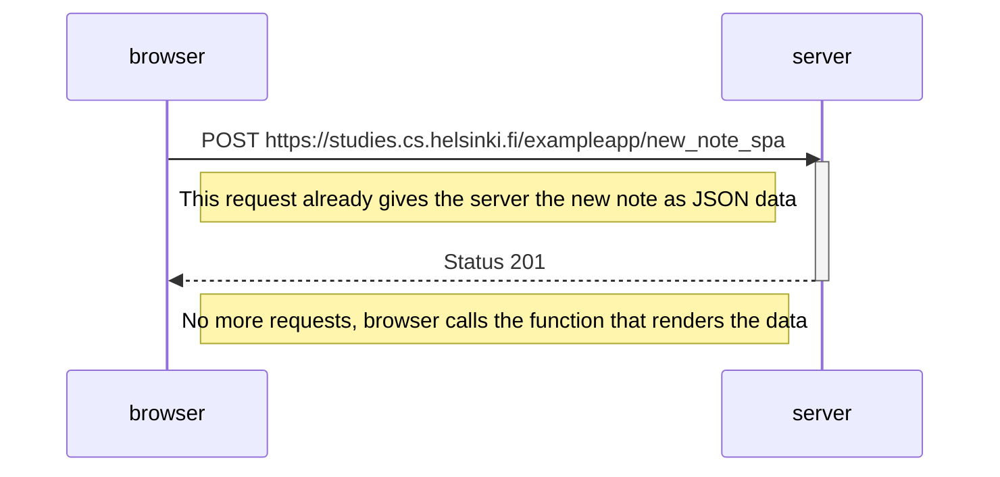

```mermaid
sequenceDiagram
    participant browser
    participant server

    browser ->> server: POST https://studies.cs.helsinki.fi/exampleapp/new_note_spa
    activate server

    Note right of browser: This request already gives the server the new note as JSON data 

    server -->> browser: Status 201
    deactivate server

    Note right of browser: No more requests, browser calls the function that renders the data
```